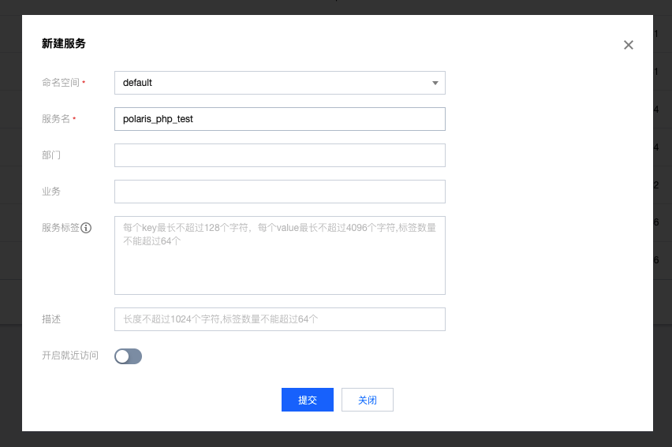
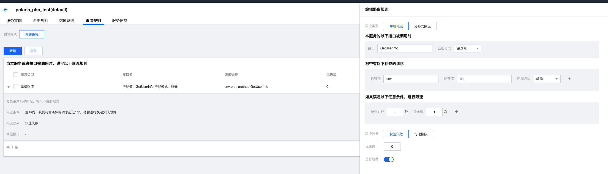

# RateLimit Example

Based on a simple polaris-php usage example, demonstrate how a php application can quickly use Polaris' service RateLimit.

## How to build

- Build the corresponding polaris-php plugin [Build documentation](../../doc/HowToBuild.md)

## How to Use

### Create Service

- Create the corresponding service through the Polaris console in advance. If it is installed through a local one-click installation package, open the console directly in the browser through 127.0.0.1:8091.
  - 
- Configure the current limiting parameters of the service
  - 


### Execute program

```shell
php ratelimit.php
```

Observe the output

- Output expected value for the first time

```
array(3) {
  ["code"]=> int(0)
  ["err_msg"]=> string(9) "0-success"
  ["quota_result"]=> array(6) {
    ["quota_result_code"]=> int(0)  // Quota is normal
    ["quota_duration"]=> int(1000)
    ["quota_left"]=> int(0)
    ["quota_all"]=> int(1)
    ["degrade"]=> bool(false)
    ["wait_time"]=> int(0)
  }
}
```

- Output expected value for the second time

```
array(3) {
  ["code"]=> int(0)
  ["err_msg"]=> string(9) "0-success"
  ["quota_result"]=> array(6) {
    ["quota_result_code"]=> int(1) // Quota is restricted
    ["quota_duration"]=> int(1000)
    ["quota_left"]=> int(0)
    ["quota_all"]=> int(1)
    ["degrade"]=> bool(false)
    ["wait_time"]=> int(0)
  }
}
```