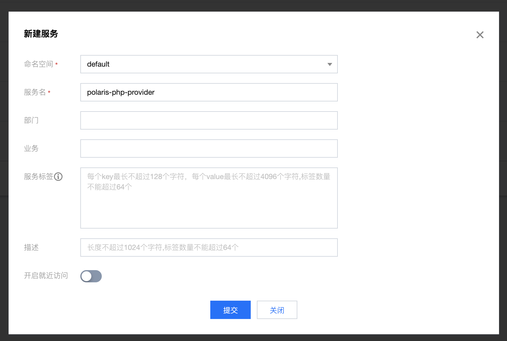
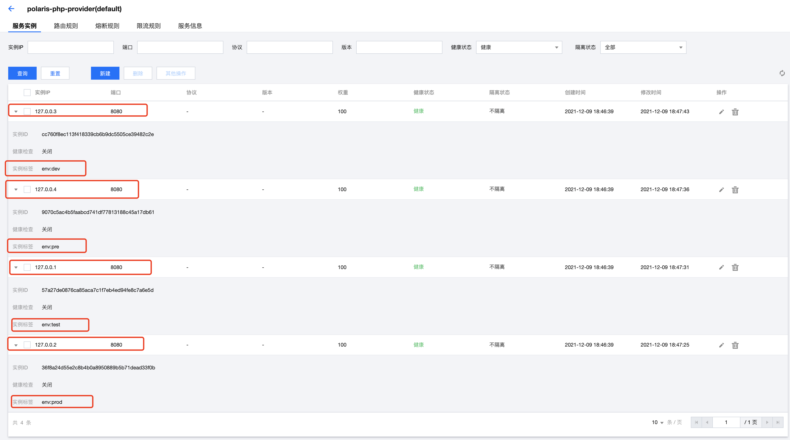
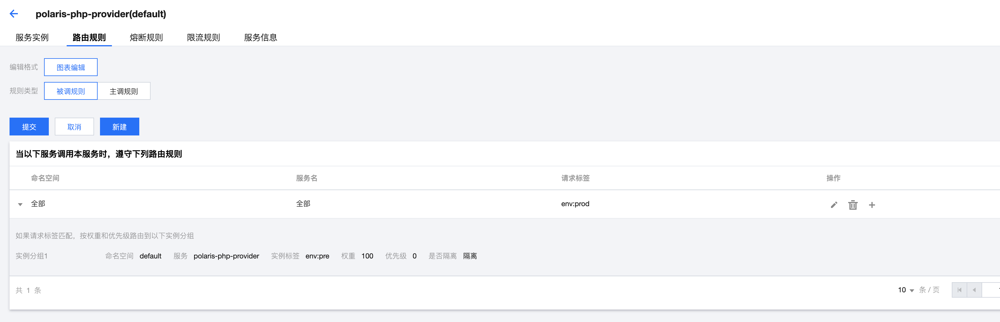

# Route Example

根据简单的 polaris-php 使用示例，演示 php 应用如何快速使用北极星的服务路由功能。

## 如何构建

- 构建对应的 polaris-php 插件, [构建文档](../../doc/HowToBuild.md)

## 如何使用

### 创建服务

- 预先通过北极星控制台创建对应的服务，如果是通过本地一键安装包的方式安装，直接在浏览器通过127.0.0.1:8091打开控制台。
  - 创建服务提供者
    - 
  - 创建服务提供这实例
    - 
  - 创建服务消费者
    - 
- 配置服务提供者的路由规则
  - 


### 执行程序

```shell
php route.php
```

观察输出结果

- 第一次输出期望值

```
array(3) {
  ["code"]=> int(0)
  ["err_msg"]=> string(9) "0-success"
  ["quota_result"]=> array(6) {
    ["quota_result_code"]=> int(0)  // 配额正常
    ["quota_duration"]=> int(1000)
    ["quota_left"]=> int(0)
    ["quota_all"]=> int(1)
    ["degrade"]=> bool(false)
    ["wait_time"]=> int(0)
  }
}
```

- 第二次输出期望值

```
array(3) {
  ["code"]=> int(0)
  ["err_msg"]=> string(9) "0-success"
  ["quota_result"]=> array(6) {
    ["quota_result_code"]=> int(1) // 配额被限流
    ["quota_duration"]=> int(1000)
    ["quota_left"]=> int(0)
    ["quota_all"]=> int(1)
    ["degrade"]=> bool(false)
    ["wait_time"]=> int(0)
  }
}
```